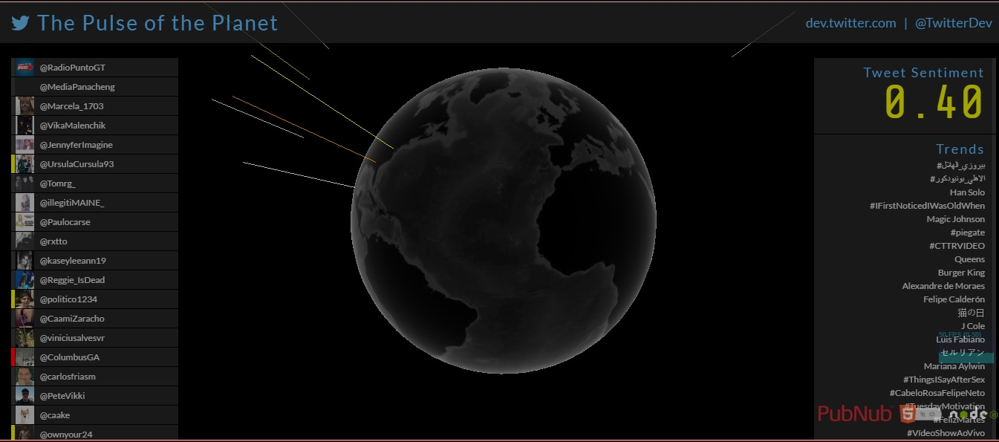
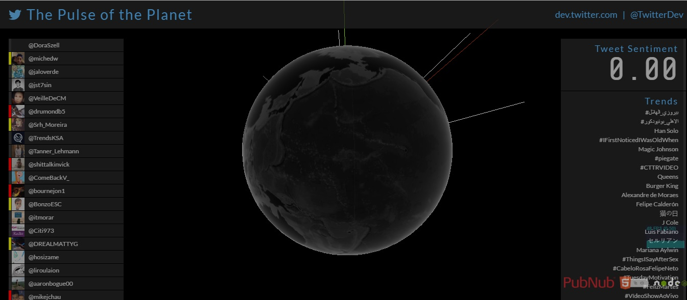
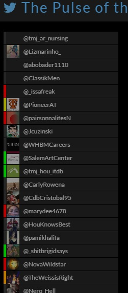

# ΙΟΝΙΟ ΠΑΝΕΠΙΣΤΗΜΙΟ 

# ΤΜΗΜΑ ΠΛΗΡΟΦΟΡΙΚΗΣ 

# ΜΑΘΗΜΑ
## Κινητά και Κοινωνικά Μέσα
 
Επιβλέπων καθηγητής: Χωριανόπουλος Κωνσταντίνος 

# Τίτλος
## Sentiment Analysis on Twitter

Αχιλλέας Καπετάνιος
ΑΜ: Π2015201

##Σύνοψη

Η εργασία είχε ως σκοπό την παρέμβαση στον κώδικα μιας εφαρμογής που μετρούσε τα συναισθήματα των tweets ανά τον κόσμο. Η εφαρμογή
ψάχνει μέσα στο σώμα των tweets για συγκεκριμένες λέξεις που είναι μέσα σε ένα αρχείο (https://github.com/ioniodi/twitter-stream-globe/blob/master/AFINN-translateToGreek165.txt) με συγκεκριμένη βαθμολογία η κάθε μία, ανάλογα με το αν είναι θετικό ή αρνητικό το συναίσθημα. Ανάλογα με τη βαθμολογία του, το κάθε tweet έπαιρνε κι ένα συγκεκριμένο χρώμα -κόκκινο αν ήταν αρνητικό και κίτρινο αν ήταν θετικό- και το αποτέλεσμα εμφανιζόταν σε μία τρισδιάστατη υδρόγειο, από την οποία έφευγαν ακτίνες με το ανάλογο χρώμα. Μπορεί κάποιος να δει την εφαρμογή εδώ https://stark-lake-93710.herokuapp.com/ και το αποθετήριό της εδώ https://github.com/ioniodi/twitter-stream-globe.

##Εισαγωγή
Στην εργασία αυτή με τις οδηγίες των παραδοτέων έγιναν δίαφορες παρεμβάσεις στην εφαρμογή που θα αναλυθούν πιο κάτω. Σε όλες τις περιπτώσεις έπρεπε να πειραχτεί ο κώδικας της εφαρμογής, και κυρίως τα αρχεία javascripts. Έπρεπε να προστεθούν αρχεία - φωτογραφίες- προκειμένου να αλλάξει η υφή της υδρογείου καθώς και να αλλάξει και το αρχείο κειμένου που περιείχε μέσα τις λέξεις ώστε να μπουν μέσα και ελληνικές λέξεις.

##Εργαλεία
Τα εργαλεία που χρησιμοποιήθηκαν ήταν πρώτα και κύρια το Github. Εκεί ήταν γραμμένος ο κώδικας της εφαρμογής καθώς κι εκεί ήταν και η πλατφόρμα επικοινωνίας για το μάθημα. Στη συνέχεια αφού φτιαχτηκε μία νέα εφαρμογή στο Twitter Apps και πάρθηκαν τα tokens και τα keys (για να επικοινωνούν οι διάφορες πλατφόρμες μεταξύ τους), καθώς και τα tokens και τα keys από το PubNub (πλατφόρμα για έλεγχο πρόσβασης και εξουσιοδότησης) και όλα αυτά μπήκαν στο Heroku, ένα online εργαλείο για τη δημιουργία εφαρμογών με πάρα πολλές δυνατότητες, και κυρίως σύνδεση με το Github , όπου εκεί θα υπήρχε και ο κώδικας της εφαρμογής μας.

## Παραδοτέο 1
### Παρεμβάσεις στα χρώματα:

Έντονα αρνητικό συναίσθημα : Κόκκινο

Αρνητικό συναίσθημα : Πορτοκαλί

Θετικό συναίσθημα : Κίτρινο

Έντονα θετικό συναίσθημα : Πράσινο

Τα χρώματα μπορεί να αλλαχτούν κατά την πορεία υλοποίησης της εργασίας.

Ενδέχεται να προκύψουν κι άλλες παρεμβάσεις στην εφαρμογή κατά την πορεία υλοποίησης της εργασίας.

### Λέξεις που θα μεταφραστούν: 
kidnap, kill, kind, kindness, kiss, lack, lame, laugh, lawsuit, lawsuits, 
leave, lethal, limits, loss, love, luck, lunatic, macabre, madness, jerk
hysteria, idiocy, insomnia, insult, irony, ironic, honor, gun, grave, comic

## Παραδοτέο 2

### Διευθυνση εφαρμογής

Σαν διεύθυνση της εφαρμογής έχει μπει το branch όπου είναι ενσωματωμένα όλα τα επιτυχημένα commits.

https://moodtonight.herokuapp.com/

#### Αλλαγές στον κώδικα της εφαρμογής

Κάθε αλλαγή στον κώδικα έγινε σε διαφορετικό branch του forked αποθετηρίου, που φέρει και το ανάλογο όνομα. Προστέθηκε επίσης ένα branch όπου περιλαμβάνει αθροιστικά όλα τα commits που είναι επιτυχημένα (All-Succesful-Commits). Το master branch είναι καθαρό και χωρίς αλλαγές. Για να λειτουργεί η εφαρμογή μέσω του heroku (προσθήκη keys, tokens του Twitter και του PubNub) δε χρειαζόταν να προστεθούν στο αρχείο tweet-publisher/index.js μια και η είσοδός τους γινόταν κατευθείαν στο heroku.

Τα χρώματα αλλάχτηκαν και διαβαθμίστηκαν όπως δηλώθηκε στο Παραδοτέο 1. Δηλαδή

Έντονα αρνητικό συναίσθημα : Κόκκινο

Αρνητικό συναίσθημα : Πορτοκαλί

Θετικό συναίσθημα : Κίτρινο

Έντονα θετικό συναίσθημα : Πράσινο

Εκτός από την αλλαγή χρώματος στις ακτίνες που φεύγουν από την υδρόγειο, έγινε αλλαγή και στην αριστερή στήλη με τη ροή των tweets, όπου κι εκεί μπήκαν τα ίδια χρώματα, με την ίδια διαβάθμιση. Το ίδιο δεν κρίθηκε σκόπιμο να γίνει στο Tweet Sentiment στη δεξιά στήλη μια και οι τιμές που παίρνει δεν ξεπερνάνε το +-0,8. Η διαβάθμιση στα χρώματα έγινε με βάση την τιμή των λέξεων από το αντίστοιχο αρχείο.

#### Αλλαγη TweetBeacon.js για την αλλαγή χρωμάτων των ακτίνων και διαβάθμισή τους. Η διαβάθμιση έγινε για:

Tweet Sentiment <= -2  -- Έντονα αρνητικό συναίσθημα

-2 < Tweet Sentiment < 0  -- Αρνητικό συναίσθημα

0 < Tweet Sentiment < 2  -- Θετικό συναίσθημα

Tweet Sentiment >= 2  -- Έντονα θετικό συναίσθημα

Η τιμές αυτές λήφθηκαν με βάση το αρχείο AFINN-translateToGreek165.txt και με δεδομένο ότι ο ανώτερος βαθμός βαρύτητας λέξης είναι 5 και ο μικρότερος -5.

https://github.com/achkap/twitter-stream-globe/blob/Changing-Beam-Colors/public/javascripts/TweetBeacon.js

Στις εικόνες φαίνονται και τα πέντε χρώματα (συν το άσπρο που είναι το ουδέτερο tweet) των ακτίνων.

#### Αλλαγή αρχείων TweetHud.js, css και scss για αλλαγή χρωμάτων και προσθήκη διαβαθμίσεων χρωμάτων στην αριστερή στήλη με τα tweets. Η διαβάθμιση χρωμάτων ακολουθεί τη λογική διαβάθμισης χρωμάτων των ακτίνων. 

https://github.com/achkap/twitter-stream-globe/blob/changing-left-column-colors/public/stylesheets/style.css

https://github.com/achkap/twitter-stream-globe/blob/changing-left-column-colors/public/stylesheets/style.scss

https://github.com/achkap/twitter-stream-globe/blob/changing-left-column-colors/public/javascripts/TweetHud.js

Στην εικόνα φαίνονται και τα τέσσερα χρώματα  της ροής των tweets.

### Λέξεις που μεταφράστηκαν: 
kidnap=απαγάγω, απαγωγή, kill=σκοτώνω, θάνατος, kind=ευγενικό, kindness=ευγένεια, kiss=φιλί, lack=έλλειψη, lame=ξενέρωτο, laugh=γελάω, γέλιο, lawsuit=μήνυση, lawsuits=μηνύσεις, 
leave=εγκαταλείπω, αφήνω, lethal=θανατηφόρο, limits=όρια, loss=απώλεια, love=αγάπη, luck=τύχη, lunatic=παράφρονας, macabre=μακάβριο, madness=τρέλα, jerk=κόπανος
hysteria=υστερία, idiocy=ηλιθιότητα, insomnia=αϋπνία, insult=προσβολή, προσβάλω, irony=ειρωνεία, ironic=ειρωνικός, honor=τιμή, gun=όπλο, grave=τάφος, comic=κόμικς

https://github.com/achkap/twitter-stream-globe/blob/add-greek-translate/AFINN-translateToGreek165.txt

## Παραδοτέο 3

Κι εδώ οι αλλαγές έγιναν σε διαφορετικό κλαδί αν και όλες αφορούν το ίδιο αρχείο: το /public/javascripts/TwitterStreamGlobe.js.
Οι αλλαγές στον κώδικα έχουν επισημανθεί σαν σχόλια στο αρχείο του forked αποθετηρίου, στο κλαδί All-succesful-commits
Όλα τα επιτυχημένα commits έχουν προστεθεί σε ειδικό κλαδί του αποθετηρίου (All-succesful-commits)

Για να μπορέσω να αλλάξω την υφή της υδρογείου έπρεπε να προσθέσω εικόνες στο φάκελο

https://github.com/achkap/twitter-stream-globe/tree/changing-earth-visualisation/public/images

Οι εικόνες που προστέθηκαν είναι της υδρογείου μέρα και νύχτα.
Έγιναν και οι ανάλογες αλλαγές στο αρχείο TwitterStreamGlobe.js ώστε να διαβάζει και να φορτώνει τις καινούριες εικόνες.

https://github.com/achkap/twitter-stream-globe/blob/changing-earth-visualisation/public/javascripts/TwitterStreamGlobe.js

Επίσης αλλάχτηκε η ταχύτητα περιστροφής της υδρογείου (πιο γρήγορη)

https://github.com/achkap/twitter-stream-globe/blob/change-earth-speed/public/javascripts/TwitterStreamGlobe.js

καθώς και η φορά περιστροφής. 

https://github.com/achkap/twitter-stream-globe/blob/change-earth-spin/public/javascripts/TwitterStreamGlobe.js

Έγινε αλλαγή και στο μέγεθος της υδρογείου, μόνο που η αλλαγή είναι μικρή μια και μια αρκετά μεγαλύτερη ή αρκετα μικρότερη υδρόγειος δε φαίνεται καλά όταν τρέχει η εφαρμογή.

https://github.com/achkap/twitter-stream-globe/blob/change-earth-size/public/javascripts/TwitterStreamGlobe.js

Τέλος έγινε και ο περιορισμός στην προέλευση των tweets στις Η.Π.Α. (μια και τα  περισσότερα tweets προέρχονται από εκεί και η οπτικοποίηση θα ήταν καλύτερη). Η αλλαγή περιοχής μπορεί να γίνει εύκολα αλλάζοντας απλά τις συντεταγμένες στο κατάλληλο σημείο του κώδικα. 

https://github.com/achkap/twitter-stream-globe/blob/limit-tweet-region/public/javascripts/TwitterStreamGlobe.js

Έχει προστεθεί κι ένα βίντεο το οποίο δείχνει την αρχική έκδοση της εφαρμογής και την εφαρμογή όπως έχει γίνει μετά από όλα τα επιτυχημένα commits. 

https://youtu.be/Baq7xVFOM0E

### Περαιτέρω βελτιώσεις
1. Να αλλάζει η υδρόγειος ανάλογα με την ώρα. Η υδρόγειος την ημέρα όταν η ώρα είναι από τις 07:00 - 18:00 και η υδρόγειος τη νύχτα όταν η ώρα είναι από τις 18:00 - 06:00
2. ....

##Παραδοτέο 4

...

